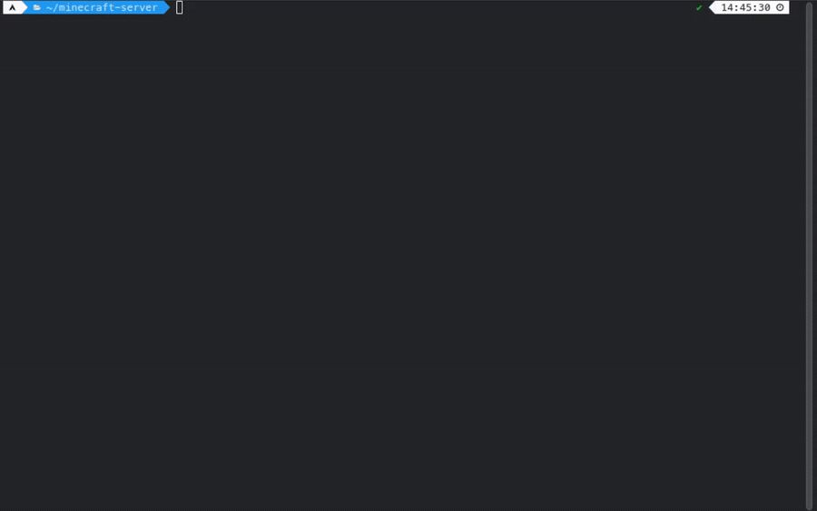

# msc (Minecraft Server Creator)

Command-line tool for downloading popular Minecraft server jars.

<p align="center">
  
</p>

## Features

- Downloads server cores directly from official sources (`vanilla`, `paper`, `purpur`, `fabric`).
- Automatically generates `eula.txt`.
- Creates launch scripts (`start.sh` for Linux or `start.bat` for Windows) with pre-configured **Aikar's Flags**.
- Auto-detects OS platform to generate the correct executable script.

## Usage

Run `msc` by specifying the core, Minecraft version, and allocated RAM:

```bash
msc <core> <version> <ram>
```

## Examples

- Vanilla

```bash
msc vanilla 1.21.11 2G
```

- Paper

```bash
msc paper 1.19.2 5G
```

- Purpur

```bash
msc purpur 26.2 4G
```

- Fabric

```bash
msc fabric 1.16.5 4G
```

- Forge

```bash
msc forge 1.20.1 5G
```

## Building from Source

If you want to compile `msc` into a standalone executable file, use `@yao-pkg/pkg`:

1. **Install dependencies:**

   ```bash
   npm install
   ```

2. **Build executables:**

- For linux (msc-linux)

```bash
   npm run build
```

- For linux arm64 (msc-linux-arm64)

```bash
   npm run build(arm64)
```

- For Windows (msc-win.exe)

```bash
   npm run build:win
```

- For Windows arm64 (msc-win-arm64.exe)

```bash
   npm run build:win(arm64)
```
